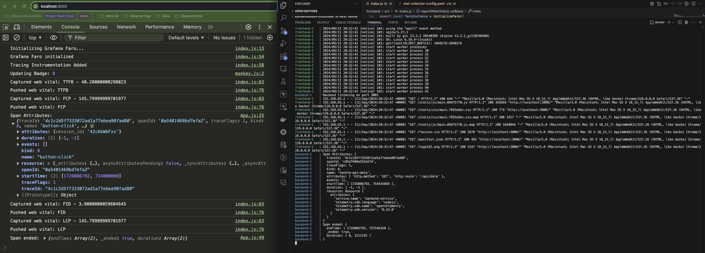

# FullStack Tracer with OpenTelemetry and Grafana Faro

## Observe Worksheet OPAL

[OPAL broken into different stages for a Worksheet](https://gist.github.com/obs-gh-jaydave/676f27e3c9508402414323aafc55bfb9)

## Introduction

**FullStack Tracer** is a powerful observability solution that integrates **OpenTelemetry** for backend tracing and **Grafana Faro** for frontend instrumentation. This project is designed to send **end-to-end telemetry** to **Observe**, a next-generation observability platform built on Snowflake, enabling seamless tracing, logging, and metrics aggregation for comprehensive monitoring of user experiences and system performance.

## Example: TraceID Visibility in Web Browser and Backend Logs

The screenshot below demonstrates how the **TraceID** can be traced in both the **Web Browser Console** (left) and in the **backend server logs** (right) using Docker Compose. This exemplifies how **Observe** can connect data across the frontend and backend to provide deep insights into user interaction and service performance.



## Key Features

1. **End-to-End Tracing with Observe**: Provides complete visibility by linking frontend traces with backend spans, capturing the full user journey from browser interactions to server-side operations, and visualizing it in **Observe**.
   
2. **Browser Log Aggregation**: Collects and aggregates console logs (such as error logs) from the frontend for querying and analysis in **Observe**.

3. **System Metrics Observation**: Tracks system metrics (CPU, memory usage, status codes) for backend services and sends them to **Observe** for monitoring performance over time.

4. **Core Web Vitals (CWV)**: Monitors critical web performance metrics like **FID** (First Input Delay), **LCP** (Largest Contentful Paint), and **CLS** (Cumulative Layout Shift) and reports them to **Observe**.

5. **Network Activity Monitoring**: Captures and tracks browser-side network requests to analyze client-side resource consumption, enabling the identification of bottlenecks and inefficiencies.

## Project Structure

- **frontend/**: Contains the React application instrumented with **Grafana Faro**, sending telemetry to **Observe**.
  
- **backend/**: Contains the Express.js backend instrumented with **OpenTelemetry**, sending trace data to **Observe** via the OpenTelemetry Collector.

- **otel-collector-config.yaml**: Configuration file for the **OpenTelemetry Collector**, which forwards both frontend and backend telemetry to **Observe**.

- **docker-compose.yaml**: Docker Compose setup to orchestrate frontend, backend, and OpenTelemetry Collector services, all configured to report to **Observe**.

## Prerequisites

Ensure the following are installed:
- **Docker** and **Docker Compose**
- **Node.js** and **npm**

## Installation and Setup

### 1. Clone the repository:
```bash
git clone https://github.com/yourusername/fullstack-tracer.git
cd fullstack-tracer
```

### 2. Install dependencies:
For the frontend:
```bash
cd frontend
npm install
```
For the backend:
```bash
cd ../backend
npm install
```

### 3. Configure Telemetry to Send Data to Observe

#### Update the OpenTelemetry Collector Configuration for Observe

In the `otel-collector-config.yaml` file, update the configuration to send traces to your **Observe** account:

```yaml
receivers:
  otlp:
    protocols:
      http:
        endpoint: "0.0.0.0:4318"
        cors:
          allowed_origins:
            - http://localhost:3000  # Allow requests from your front-end
          allowed_headers:
            - "*"
      grpc:
        endpoint: "0.0.0.0:4317"

processors:
  batch:

exporters:
  otlphttp:
    endpoint: "https://<OBSERVE_CUSTOMER_ID>.collect.observeinc.com/v2/otel"
    headers:
      authorization: "Bearer <OBSERVE_API_TOKEN>"

service:
  pipelines:
    traces:
      receivers: [otlp]
      processors: [batch]
      exporters: [otlphttp]
```
Replace `<OBSERVE_CUSTOMER_ID>` and `<OBSERVE_API_TOKEN>` with your **Observe** credentials.

#### Update the Frontend to Send Telemetry to Observe

In the `frontend/src/index.js`, update the **Grafana Faro** configuration to push telemetry data directly to the **Observe** HTTP endpoint:

```js
import { initializeFaro, getWebInstrumentations } from '@grafana/faro-web-sdk';
import { FetchTransport } from '@grafana/faro-web-sdk';
import { TracingInstrumentation } from '@grafana/faro-web-tracing';

export const faroInstance = initializeFaro({
  app: {
    name: 'FrontendApp',
    version: '1.0.0',
  },
  batching: {
    enabled: true,
    limit: 100,
    interval: 300000, // 5 minutes
  },
  sessionTracking: {
    enabled: true,
  },
  instrumentations: [
    ...getWebInstrumentations({
      enablePerformanceInstrumentation: false,
    }),
    new TracingInstrumentation({ propagateTraceContext: true }),
  ],
  transports: [
    new FetchTransport({
      url: 'https://<OBSERVE_CUSTOMER_ID>.collect.observeinc.com/v1/http?source=faro',
      requestOptions: {
        headers: {
          'Authorization': 'Bearer <OBSERVE_API_TOKEN>',
        },
      },
      beforeSend: (events) => {
        return events.filter(event => ['log', 'error', 'trace'].includes(event.domain));
      },
      onError: (error) => {
        console.error('Error sending traces:', error);
      },
    }),
  ],
});
```
Replace `<OBSERVE_CUSTOMER_ID>` and `<OBSERVE_API_TOKEN>` with your **Observe** credentials.

### 4. Build and Run the Docker Containers:
```bash
docker-compose up --build
```

### 5. Access the application:
- **Frontend**: [http://localhost:3000](http://localhost:3000)
- **Backend**: [http://localhost:3001](http://localhost:3001/api/data)

## Observability with Observe

### Frontend Telemetry

The frontend leverages **Grafana Faro** to capture browser interactions and performance metrics. These events, such as button clicks, Core Web Vitals, and network activity, are sent directly to **Observe** using the Faro SDK. **Observe** provides dashboards and tools for querying and visualizing this telemetry, helping you to monitor and optimize the client-side performance of your application.

### Backend Tracing

The backend is instrumented with **OpenTelemetry**, capturing all HTTP requests and server-side processing. The **OpenTelemetry Collector** receives this data and exports it to **Observe**, where you can view traces and logs, helping you monitor your services' performance and identify bottlenecks.

### System Metrics and Logs

With **Observe**, you can go beyond tracing and use the platform to gather and analyze system metrics (CPU, memory) and aggregate logs across your application. This enables a holistic view of your infrastructure's health and performance.

## Conclusion

**FullStack Tracer** demonstrates how **Observe** can be used to build a complete observability pipeline, linking frontend and backend traces, monitoring system metrics, and capturing browser logs. With this setup, you gain full visibility into both user interactions and server-side operations, helping you to identify and resolve performance issues quickly and efficiently.

